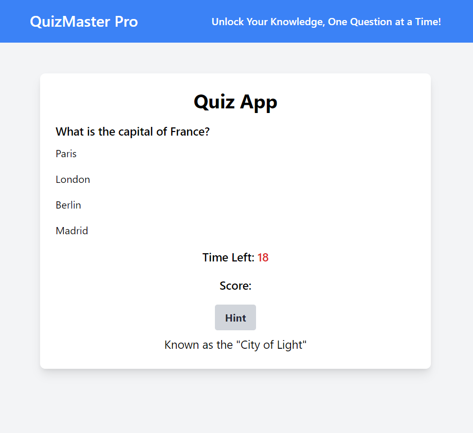

# QuizMaster Pro - Interactive Quiz App

Welcome to QuizMaster Pro, an interactive quiz application that allows users to test their knowledge on various topics while having fun! With QuizMaster Pro, users can unlock their knowledge, one question at a time.



## Table of Contents
- [Features](#features)
- [Getting Started](#getting-started)
- [Usage](#usage)
- [Contributing](#contributing)
- [License](#license)
- [Acknowledgements](#acknowledgements)

## Features

- **Multiple Choice Questions**: Users can answer multiple-choice questions covering a wide range of topics.
- **Shuffle Questions**: Questions are shuffled each time the quiz starts to provide variety.
- **Skip Question**: Users can choose to skip a question and move on to the next one without answering.
- **Timer**: Each question has a countdown timer to add a sense of urgency.
- **Hint System**: Users can request hints for difficult questions to help them answer correctly.
- **Scoring System**: Users earn points for each correct answer, and their final score is displayed at the end of the quiz.
- **Responsive Design**: The app is designed to be responsive, ensuring a seamless experience across different devices.

## Getting Started

To get started with QuizMaster Pro, simply clone this repository to your local machine:

```bash
git clone https://github.com/your-username/quizmaster-pro.git
```

Then, open the index.html file in your web browser to start using the quiz app.

## Usage
Start the Quiz: Click on the "Start Quiz" button to begin the quiz.
Answer Questions: Read each question carefully and select the correct answer from the options provided.
Timer: Pay attention to the timer and try to answer each question within the time limit.
Hints: If you're stuck on a question, click the "Hint" button to get a helpful hint.
Score: Your score will be displayed at the end of the quiz, showing how many questions you answered correctly.
Contributing
Contributions are welcome! If you'd like to contribute to QuizMaster Pro, please follow these steps:

## Fork the repository.
Create a new branch for your feature (git checkout -b feature-name).
Make your changes and commit them (git commit -am 'Add new feature').
Push your changes to your forked repository (git push origin feature-name).
Create a pull request.
License
This project is licensed under the MIT License - see the LICENSE file for details.

## Acknowledgements
This project was inspired by the desire to create an engaging and educational quiz app.
Special thanks to the contributors and open-source community for their valuable contributions and resources.
